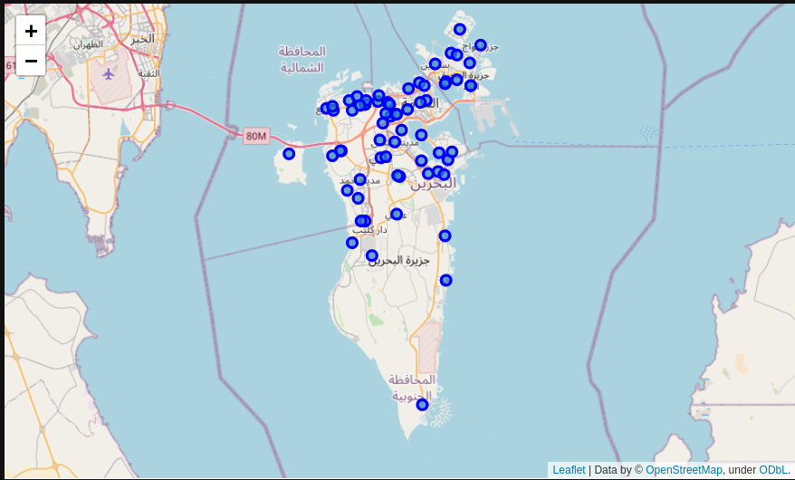
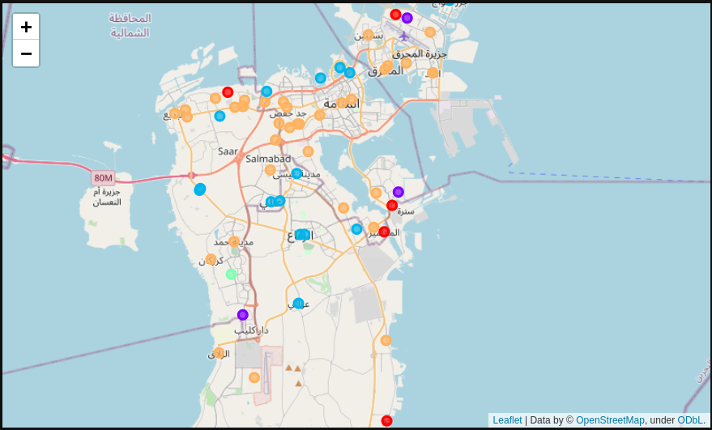

# The Foodie's Guide to finding a home in Bahrain

## Introduction

I am a foodie looking for a place stay in Bahrain. I want to study certain areas in Bahrain and the kind of restaurants that surround them.

I think that a lot of people, not just the youth could benefit from this solution, because the problem isn't just finding a decent place to stay in Bahrain, but finding one that best serves their culinary interests perhaps. I mean there are obviously much better factors to look at besides food. However for this problem I want to stick to what I can gain from Foursquare with a free license. Thus, by neatly categorizing areas from their surrounding attributes (such as frequency of coffee shops, closeness to malls etc) I can they can make a better guesstimate of where they might stay. Foursquare allows us to grab information on venues surrounding a given location, and therefore we will look into the most frequent kind of venues surrounding a given area, and cluster areas based on that. 

## Data Requirements
Firstly I would need to scrap data from Wikipedia to lookup towns and cities in Bahrain. After that, I will geocode these areas to get their coordinates using popular geocoders like OpenStreetMap and Map Quest. Futhermore, we'll leverage the Foursquare API to gather the most common types of restaurants associated with an area within 500m of its center. We'll then look at various food places and restaurants and extract their types for further analysis.
I will use machine learning to further my analysis on this project.

## Methodology
All of the work on this project will be done on jupyter notebooks.

Since our first and ultimate goal revolves around working with data which are vastly numeric in type such as latitude and longitude values for coordinates, I will leverage the [Pandas](https://pandas.pydata.org/) library to store, load and process this data. We gather the areas in a pandas dataframe for easy processing, and attempt to collect coordinates that can be processed efficiently using such a library.
In order to get the most trusted list of places in Bahrain, we will refer to this [Wikipedia page](https://en.wikipedia.org/wiki/Category:Populated_places_in_Bahrain) as a source to begin with. 

TK We can extract pieces of text from websites using a popular webscraper called [Beautiful Soup](https://beautiful-soup-4.readthedocs.io/en/latest/). We can use the filter the text from the site for areas in Bahrain. After doing this, we form our first dataframe with that data called `bh_data`.

For futher consideration, we will need the ask questions such as, "does it cover all areas mentioning in the Wikipedia Page?" or "Are there ambigious and confusing elements to those locations like repeated points or missing locations?". Upon ansering these, we can then proceed further.

After we are confident that we have the names of all major areas in Bahrain, we have to geocode them; a process that converts them from a string to latitude & longitude values marking their location on a map. We can use popular geocoding APIs such as [Open Street Map](https://www.openstreetmap.org/) and [Map Quest](https://www.mapquest.com/). We use both of them, since they're the least difficult to get a free account with, and to ensure we don't have any discrepancies or if the name of a particular location doesn't returns an valid result. After geocoding, we store the cooridinates into our existing dataframe `bh_data` as seen below. Our process of data collection has now ended.

| Index |    Area   |  Latitude |  Longitude  |
|:-----:|:---------:|:---------:|:-----------:|
|   0   | A'ali     | 26.154454 | 50.527364   |
|   1   | Abu Baham | 26.205737 | 50.541668   |
|   2   | Abu Saiba | 30.325299 | 48.266157   |
|   3   | Al Garrya | 20.639623 | -100.477387 |
|   4   | Al Hajar  | 26.225405 | 50.59013    |

For the sake of visual analysis, we must utilize mapping libraries like [Folium](https://python-visualization.github.io/folium/) to plot our areas as points on a map, so we can better visualize our findings. This will aid us in our analysis as we can better synthesize our results.

For the second part, we will look at [Foursquare](https://foursquare.com/) to get us the surrounding food places within 500m of the area's center (an arbitrary radius to avoid collision with venues present in other areas).

Foursquare is a service that aids us in obtaining location-based data that details venues, reviews and users' who have reviewed the said venues.
For our use-case, we will look only at the list of food places within each area in Bahrain and their food category.

For the third part of our project, our business problem relies on segmenting areas based on the most common type of food places within the area. This gives us an idea about the type of area it is from a culinary point-of-view, and allowing us to make judgments on whether the food is ideal to our taste or not. We also want to factor in the total number of food places within an area since some places in Bahrain may not be ideal to live in if they don't even have enough places to eat.

We use the foursquare API to return all restaurants along with their types, in Bahrain and call this `bh_foods`. 
| Index |  Area | Area Latitude | Area Longitude |                  Venue                  | Venue Latitude | Venue Longitude | Venue Category |
|:-----:|:-----:|:-------------:|:--------------:|:---------------------------------------:|:--------------:|:---------------:|:--------------:|
|   0   | A'ali | 26.154454     | 50.527364      | Costa Coffee                            | 26.157464      | 50.525873       | Coffee Shop    |
|   1   | A'ali | 26.154454     | 50.527364      | Chilis Aali                             | 26.152996      | 50.526268       | Diner          |
|   2   | A'ali | 26.154454     | 50.527364      | Starbucks                               | 26.158186      | 50.528168       | Coffee Shop    |
|   3   | A'ali | 26.154454     | 50.527364      | Hospital Resturant (كافيتيريا المستشفى) | 26.153012      | 50.526232       | Restaurant     |
|   4   | A'ali | 26.154454     | 50.527364      | كفتيريا المستشفى                        | 26.153455      | 50.528375       | Restaurant     |

Using the dataframe, we then form a one-hot encoding of the `Venue Category` field that produces new columns for each category. Each record in this table corresponds to a certain venue and a 1 is placed in the category field. The only other field that is retained is the area name. We call this `bh_onehot`.

|   |  Area | Afghan Restaurant | African Restaurant | American Restaurant | Arepa Restaurant | Asian Restaurant | BBQ Joint | .. |
|--:|------:|------------------:|-------------------:|--------------------:|-----------------:|-----------------:|----------:|---:|
| 0 | A'ali | 0                 | 0                  | 0                   | 0                | 0                | 0         | .. |
| 1 | A'ali | 0                 | 0                  | 1                   | 0                | 0                | 0         | .. |
| 2 | A'ali | 0                 | 1                  | 0                   | 0                | 0                | 0         | .. |
| 3 | A'ali | 0                 | 0                  | 0                   | 1                | 0                | 0         | .. |
| 4 | A'ali | 0                 | 0                  | 0                   | 0                | 0                | 0         | .. |

 We use this table and group by area, to find the mean of the frequency for each category of restaurant along with the count of the food places as the field: `NumberOfFoodPlaces` 

| Index |      Area | Afghan Restaurant | African Restaurant | American Restaurant | Arepa Restaurant | Asian Restaurant | BBQ Joint | Bagel Shop | .. | NumberOfFoodPlaces |
|------:|----------:|------------------:|-------------------:|--------------------:|-----------------:|-----------------:|----------:|-----------:|---:|-------------------:|
|   0   | A'ali     | 0.0               | 0.0                | 0.0                 | 0.0              | 0.00             | 0.000000  | 0.0        | .. | 19                 |
|   1   | Abu Baham | 0.0               | 0.0                | 0.0                 | 0.0              | 0.00             | 0.111111  | 0.0        | .. | 9                  |
|   2   | Al Daih   | 0.0               | 0.0                | 0.0                 | 0.0              | 0.02             | 0.000000  | 0.0        | .. | 50                 |
|   3   | Al Dair   | 0.0               | 0.0                | 0.0                 | 0.0              | 0.00             | 0.111111  | 0.0        | .. | 9                  |
|   4   | Al Garrya | 0.0               | 0.0                | 0.0                 | 0.0              | 0.00             | 0.066667  | 0.0        | .. | 15                 |

Let's call this this `bh_grouped`. Now that we have this processed information, we can analyze this data more clearly by reordering it so that only the 10 most common type of food places for an area are retained.

So a new dataframe called `foods_sorted` is created.

| Index |      Area | NumberOfFoodPlaces | 1st Most Common Food Place | 2nd Most Common Food Place | 3rd Most Common Food Place | 4th Most Common Food Place | 5th Most Common Food Place | 6th Most Common Food Place | 7th Most Common Food Place | 8th Most Common Food Place | 9th Most Common Food Place | 10th Most Common Food Place |
|------:|----------:|-------------------:|---------------------------:|---------------------------:|---------------------------:|---------------------------:|---------------------------:|---------------------------:|---------------------------:|---------------------------:|---------------------------:|----------------------------:|
|   0   | A'ali     | 19                 | Café                       | Restaurant                 | Cupcake Shop               | Coffee Shop                | Middle Eastern Restaurant  | Diner                      | Food                       | Falafel Restaurant         | Breakfast Spot             | Sandwich Place              |
|   1   | Abu Baham | 9                  | Middle Eastern Restaurant  | Fish & Chips Shop          | Mediterranean Restaurant   | Ice Cream Shop             | Restaurant                 | BBQ Joint                  | Donut Shop                 | Cafeteria                  | Pakistani Restaurant       | Noodle House                |
|   2   | Al Daih   | 50                 | Middle Eastern Restaurant  | Dessert Shop               | Bakery                     | Breakfast Spot             | Cafeteria                  | Restaurant                 | Diner                      | Café                       | Sandwich Place             | Italian Restaurant          |
|   3   | Al Dair   | 9                  | Bakery                     | Fast Food Restaurant       | Restaurant                 | BBQ Joint                  | Italian Restaurant         | Afghan Restaurant          | Pastry Shop                | Pakistani Restaurant       | Noodle House               | Movie Theater               |
|   4   | Al Garrya | 15                 | Mexican Restaurant         | Taco Place                 | Burger Joint               | Restaurant                 | BBQ Joint                  | Bakery                     | Food Stand                 | Lounge                     | Pakistani Restaurant       | Noodle House                |
---
Now we are ready for further analysis and clustering. We will use the `bh_grouped` dataframe since it contains the necessary numerical values for machine learning.

Our feature set is comprised of all the food categories (100 features).

We are excluding the `NumberOfFoodPlaces` feature as input to the ML model, since the business problem requires us to segment areas by the type of food available. This quantity is only relevant to us to finally decide whether to live in an area or not. Another more concrete reason to exclude it, is the fact that there are all sorts of factors involved that we're neglecting due to lack of data, such as living costs, access to public transport etc. This is a foodie's guide to finding a place, and shouldn't be disturbed by the fact that there are sometimes low number of restaurants in some areas.

Our target value will be the cluster labels.

For our machine learning analysis, we will use the simplest clustering algorithm to separate the areas which is **K-Means Clustering**; an unsupervised machine learning approach to serve our purpose. We will use the popular machine learning library Sci-Kit Learn (sklearn).

We will pick the number of clusters `kcluster = 5`, for the sake of examination. We then fit the model on the entire data, and produce our cluster labels. These labels will then be visualized on a map using Folium along with their areas.

## Results
Looking at the Folium map that we've discovered, we can see a decent level of segmentation; meaning that the areas aren't clustered greatly towards a few particular clusters. We get 5 different colored points where each point signifies a location and the color will signify the cluster it belongs to.
We could try for a better value for `kclusters` i.e. the number of clusters.

## Discussions
After studying the clusters, the following things have been noted which is also considering common presumptions concerning the places as a citizen of Bahrain.

### Cluster 1:
- **Size of Cluster**: 5 Areas
- **Variation in Features**: Not much, they seem to revolve around bakeries, though we can't trust much of this considering the number of food places is low. This is especially true in the case of Jaww, Ma'ameer & Sitra.
For Al Dair & Jannusan, they have relatively higher number of places and have bakeries as their number 1 spot.
- **Geographical Features**: Al Dair and Jannusan lie on far ends of the north, though they have similar features.
Jaww is an outlier considering it is much farther down south.
The other 2 places are rather close to each other.

### Cluster 2:
- **Size of Cluster**: 3 Areas
- **Variation in Features**: Defined by coffee shops, Afghan and regular restaurants. There are very few places in each area (amounting to 3-4 food places in each) to form a proper discussion about them.
- **Geographical Features**: These locations are all farther apart in terms of location.

### Cluster 3:
Contains the 2nd most diverse set of areas with varied number of food places in each area.
- **Size of Cluster**: 15 Areas
- **Variation of Features**: Caffes, Middle Eastern & Asian Cuisine dominate this cluster. Pizza places and American food make their debut here too. It seems to be an incredible set of areas to live in. This might be a good choice, but let's look further.
- **Geographical Features**: These areas exist all across Bahrain.

### Cluster 4:
- **Size of Cluster**: 2 Areas (Smallest Cluster)
- **Variation in Features**: This is a niche cluster, and when we look *Hilat Abdul Saleh*, it contains 31 food places with a majority of them as Breakfast Spots and Food trucks. A similar area is *Al Malkiya* which contains only 4 places with Food Truck taking first place.
- **Geographical Features**: These areas are great in distance compared to each other.

### Cluster 5:
This seems like the best set of areas to live in.
- **Size of Cluster**:  45 (Largest Cluster)
- **Variation in Features**: This is the most diverse cluster,  with varied number of food places per area and similar to cluster 3 in terms of variety. We could say that the area serves the most exotic kinds of foods with Middle Eastern cuisine taking up first place in almost half of the areas. We could also say that it represents higher standards of living considering that most of these areas cover the capital.
- **Geographical Features**: Covers most of the habital parts of Bahrain.

## Conclusion
The results were done using `kcluster=5`, however we could do further analysis to find the best size using the *elbow method* for clustering problems. The project has seen good results when put to the task. 

Some of the difficulties encountered were the lack of a reliable list of locations in Bahrain. I've found that there are some discrepancies when scrapping data from Wikipedia, as a city called *Northern City* had to be removed when it pointed to a location far north-west of Bahrain, in the sea where obviously no food places exist. Another is the almost absence of food place since certain areas in Bahrain with 3 to 4, and some even being exluded as they didn't turn up any valid result; with a notable exclusion of *Umm al Nassan*.

Moreover, getting enough data to provide features for habital conditions of these areas was lacking from the Foursquare API. Future sources could be looked at to overcome this.

Nonetheless, this project has future scope to introduce not only as a business solution to prospective homeowners, but the datasets created could be hosted on Kaggle and data science problems for others to study & analyze.